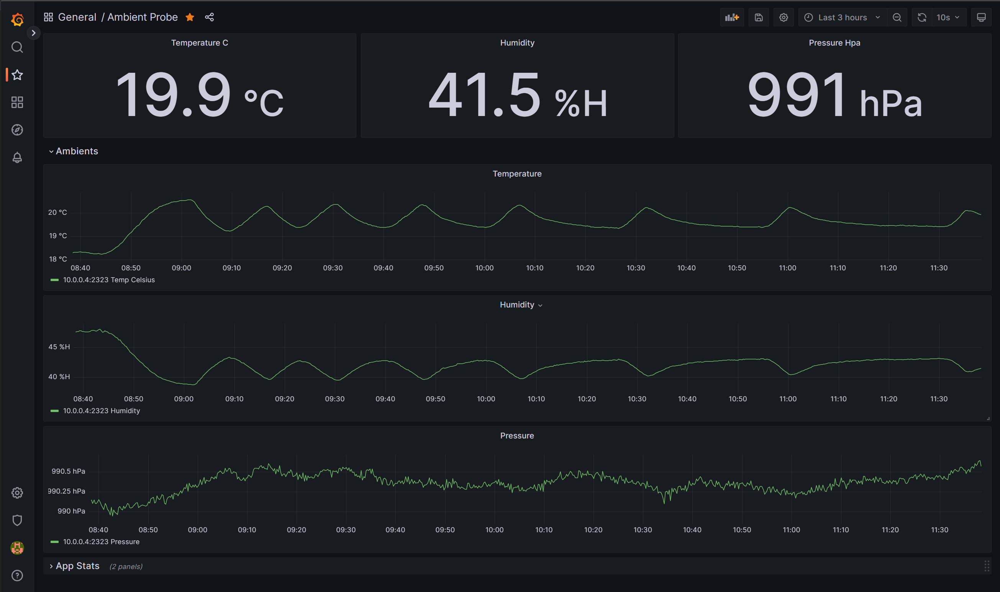

# ambientprobe

A simple prometheus exporter for a [BME280](https://www.waveshare.com/wiki/BME280_Environmental_Sensor) temperature/humidity/pressure sensor attached to a Raspberry pi.

The systemd folder contains a systemd service unit for the app

The scrape point is exposed on port 2323 as `/metrics`

The grafana folder contains a dashboard for the data

